# tg-news-channel-bot

Automated Telegram channel bot that fetches movie/entertainment news from RSS, scores articles with GPT-4, rewrites them in a distinctive ironic voice, and posts the best ones on a smart schedule.

## What it does

1. **Fetches** articles from [Deadline.com](https://deadline.com) RSS feed on a configurable interval
2. **Rates** each article via GPT-4 on two axes — general interest (0–100) and suitability for the channel's style (0–100)
3. **Rewrites** the top-scoring article in one of four satirical styles
4. **Posts** the result to a Telegram channel, with an optimized image attached
5. **Schedules** itself dynamically — active during daytime (100–140 min intervals), quiet overnight (4–4.5 h intervals)

## Architecture



```
RSS Feed (Deadline.com)
        │
        ▼
  FeedManager          — parses feed, filters by time window, deduplicates
        │
        ▼
DatabaseManager        — PostgreSQL connection pool, stores articles & ratings
        │
        ├──► AIProcessor.rate_article()      — GPT-4 scores each article
        │
        └──► AIProcessor.translate_to_lurk() — multi-stage GPT rewrite
                  │   1. Main translation (gpt-4)
                  │   2. Grammar check    (gpt-4-mini)
                  │   3. Condensing       (gpt-4-mini, if > 1000 chars)
                  ▼
         TelegramManager                     — formats & posts to channel
                  │
                  └──► ImageProcessor        — downloads, resizes, compresses image
```

**Key design choices:**
- Full async/await pipeline (`asyncio`) for non-blocking I/O
- Pydantic v2 `BaseSettings` with `SecretStr` for safe config management
- PostgreSQL connection pooling (`psycopg2.pool.SimpleConnectionPool`)
- `tenacity` retry decorator on all external API calls (3 attempts, exponential backoff)
- Scenario-based prompt system — 4 writing styles loaded at runtime by `AIScenarioManager`

## Tech stack

| Layer | Technology |
|---|---|
| Language | Python 3.11+ |
| Async runtime | `asyncio` |
| Telegram | `aiogram 3`, `python-telegram-bot` |
| AI | `openai` (GPT-4 / GPT-4-mini) |
| Database | PostgreSQL 14+ via `psycopg2` |
| Config | `pydantic-settings` |
| Feed parsing | `feedparser`, `beautifulsoup4` |
| Images | `Pillow` |
| Retries | `tenacity` |

## Project structure

```
tg-news-channel-bot/
├── main_controller.py      # Entry point, orchestration loop
├── feed_manager.py         # RSS fetching and article parsing
├── ai_processor.py         # GPT-4 rating and content rewriting
├── AIScenarioManager.py    # Writing-style prompt templates
├── telegram_manager.py     # Telegram channel posting
├── image_processor.py      # Image download, resize, compress
├── database_manager.py     # PostgreSQL CRUD layer
├── config_manager.py       # Database-backed dynamic config
├── error_handler.py        # Error tracking and health monitoring
├── models.py               # Article / RatingResult dataclasses
├── config.py               # Pydantic settings
├── schema.sql              # Database schema and indexes
├── requirements.txt        # Python dependencies
└── .env.example            # Environment variable template
```

## Setup

### Prerequisites

- Python 3.11+
- PostgreSQL 14+
- OpenAI API key
- Telegram bot token ([@BotFather](https://t.me/BotFather))
- Telegram channel where the bot is an admin

### Installation

```bash
git clone https://github.com/alex-p-pigeon/tg-news-channel-bot.git
cd tg-news-channel-bot

python -m venv venv
source venv/bin/activate        # Windows: venv\Scripts\activate

pip install -r requirements.txt
```

### Database

```bash
createdb lurkdb
psql lurkdb < schema.sql
```

### Configuration

```bash
cp .env.example .env
# Fill in your values in .env
```

| Variable | Description |
|---|---|
| `BOT_TOKEN` | Telegram bot token from BotFather |
| `TG_CHANNEL_ID` | Target channel (invite link or `@username`) |
| `TG_API_ID` / `TG_API_HASH` | Telegram API credentials (my.telegram.org) |
| `TG_PHONE` | Phone number linked to your Telegram account |
| `OPENAI_API_KEY` | OpenAI API key |
| `DB_HOST` / `DB_PORT` / `DB_NAME` / `DB_USER` / `DB_PASSWORD` | PostgreSQL connection |

### Run

```bash
python main_controller.py
```

The bot starts immediately, runs one full cycle, then schedules itself automatically.

## Posting schedule

| Time | Interval |
|---|---|
| 08:00 – 00:00 | Random 100–140 minutes |
| 00:00 – 08:00 | Random 4 h – 4 h 30 min |

## Content pipeline detail

### Article rating

Each article is rated by GPT-4 on two dimensions:

- **interest_score** — how relevant the story is for a Russian-speaking film audience
- **lurkable_score** — how well the story fits the channel's ironic, meme-heavy tone

Only articles exceeding both `MIN_RATING_THRESHOLD` (60) and `MIN_LURKABLE_THRESHOLD` (70) are published.

### Writing styles

| Style | Description |
|---|---|
| `lurk` | Lurkmore.ru style — sarcastic, black humor, internet folklore |
| `deadpan academic` | Pseudo-intellectual irony |
| `inet shitposter` | Chaotic meme energy, Discord/TikTok register |
| `old cynic` | Soviet grandpa skepticism |

One style is selected at random per post.

## Running tests

```bash
pip install pytest pytest-asyncio
pytest tests/
```

## License

MIT
